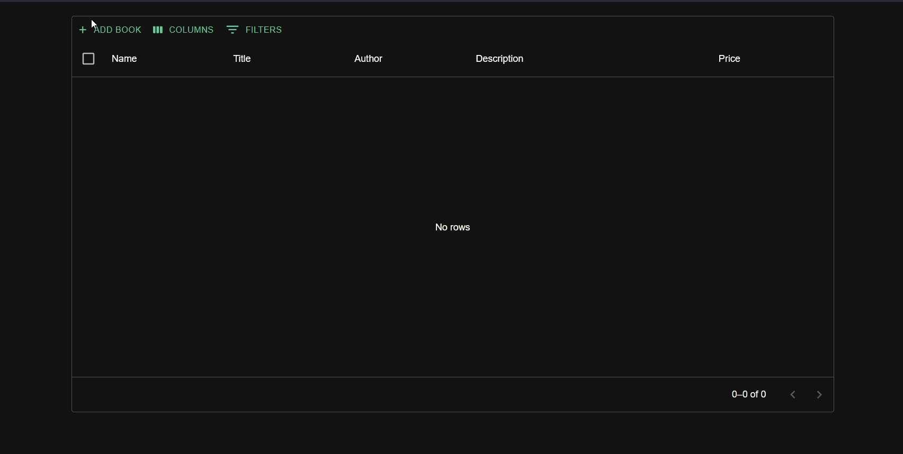
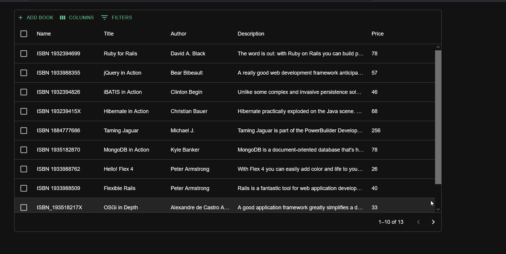
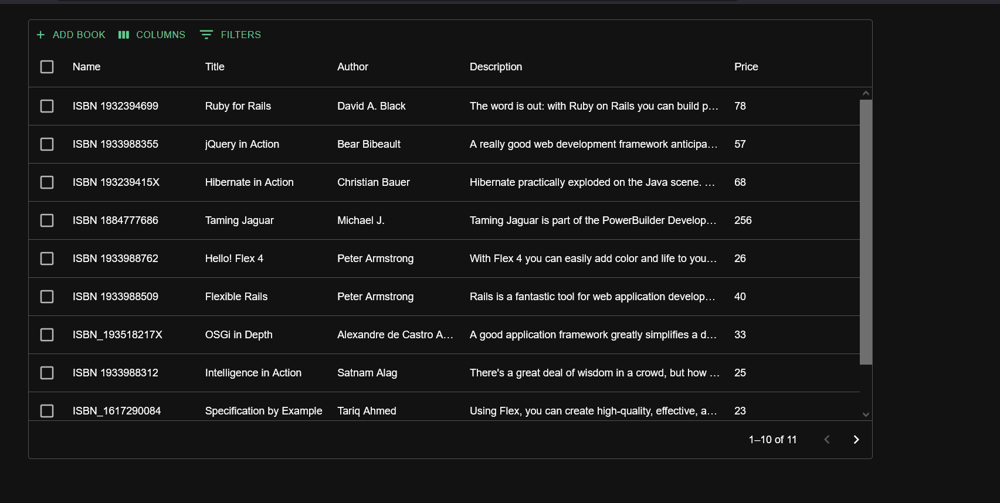
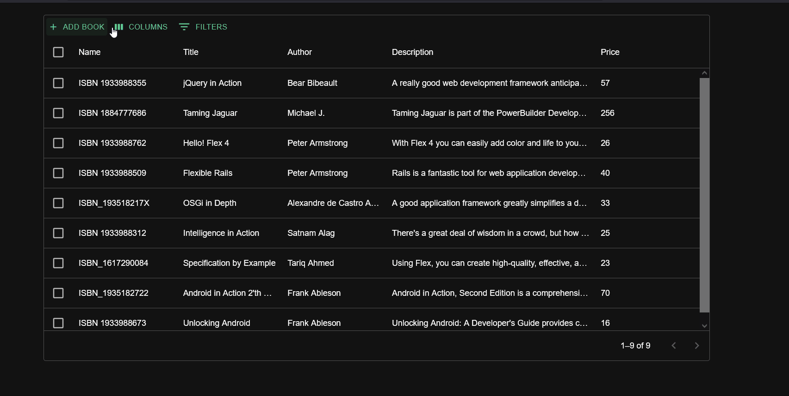

# BookList Project

# Table of content

- [Features](#features)
- [Installation steps](#installation-steps)
- [Development Environment](#development-environment)
- [Testing](#run-test)
- [License](#license)

## Features

1.  Add new book



2. Edit a book



3. Delete books



4. Manage columns visibility



## Installation steps

1. Clone the repository to the local computer

```
git clone https://github.com/ibraym/py-book-list
```

2. Change to the repository folder

```
cd py-book-list
```

3. Build docker images

```
docker-compose -f docker-compose.yml -f docker-compose.dev.yml build
```

4. Start the docker containers

```
docker-compose up -d
```

5. Access the application through the browser using the link http://localhost:8080

## Development Environment

1. Install necessary dependencies (Ubuntu 20.04):

```
sudo apt-get update && sudo apt-get --no-install-recommends install -y build-essential curl git python3-dev python3-pip python3-venv pkg-config apache2-dev

```

```
# Install Node.js 16 and yarn
curl -sL https://deb.nodesource.com/setup_16.x | sudo -E bash -
sudo apt-get install -y nodejs
sudo npm install --global yarn
```

2. Install Chrome.
3. Install VS Code.
4. Install the following VScode extensions:
   - JavaScript Debugger
   - Python
   - ESLint
   - Stylelint
   - Prettier Formatter for Visual Studio Code
   - licenser
   - Trailing Spaces
   - Code Spell Checker
5. Make sure to use Python 3.9.0 or higher

```
python3 --version
```

6. Install BookList on your local host:

```
git clone https://github.com/ibraym/py-book-list
cd py-book-list
python3 -m venv .env
. .env/bin/activate
pip install -U pip wheel setuptools
pip install \
    -r booklist/requirements/development.txt \
    -r booklist/requirements/production.txt
python manage.py migrate
python manage.py collectstatic
```

7. Install npm packages for UI (run the following command from py-book-list root directory)

```
yarn --frozen-lockfile
```

8. Start npm UI debug server (run the following command from py-book-list root directory):

```
yarn run start:booklist-ui
```

9. Open a new terminal window.
10. Run VScode from the virtual environment (run the following command from py-book-list root directory):

```
source .env/bin/activate && code
```

11. Inside VScode, Open py-book-list root dir
12. Select `server: debug` configuration and run it (F5) to run REST server

You have done! Now it is possible to insert breakpoints and debug server and client of the tool.

## Run test

To run test, run the following command inside py-book-list folder:

```
python manage.py test --settings booklist.settings.testing booklist/apps/
```

## License

The code is released under the MIT License.
